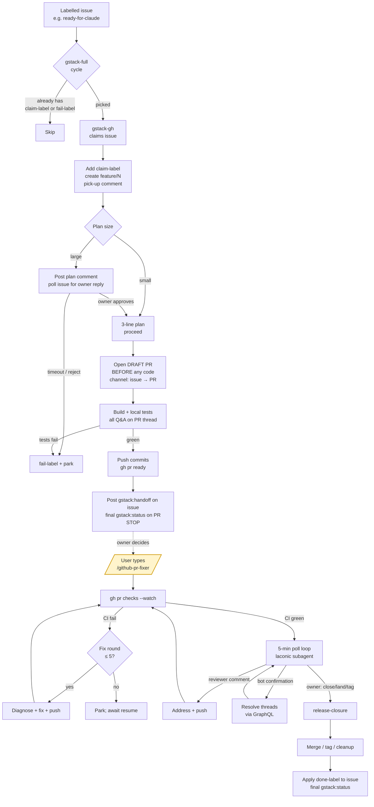
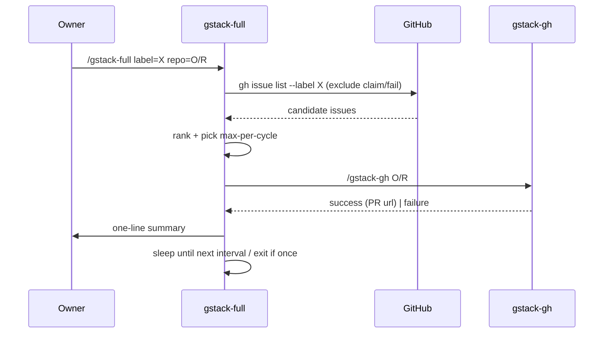
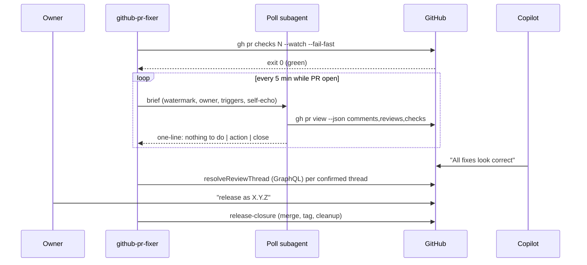
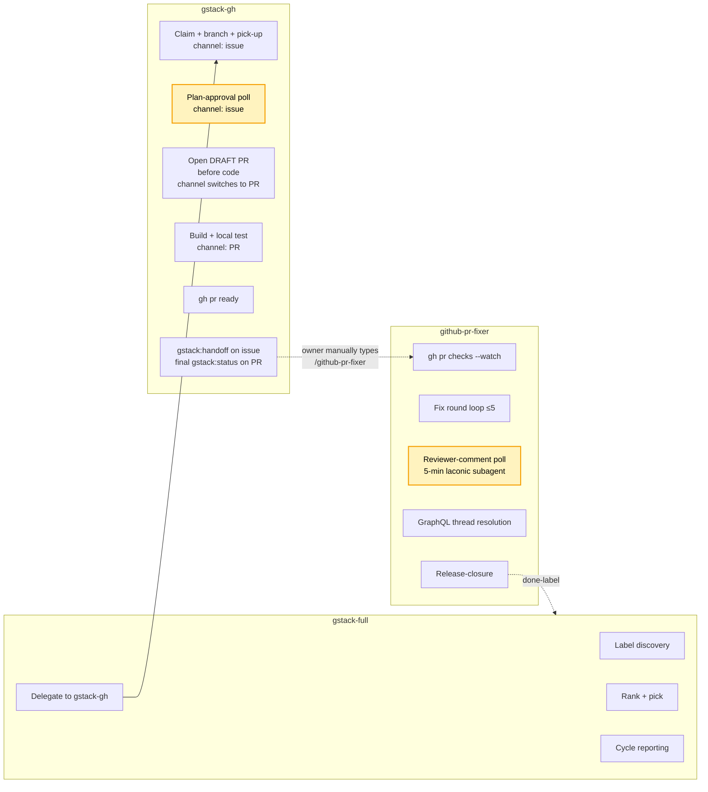

# gstack-workflow — how gstack-full, gstack-gh, and github-pr-fixer fit together

## Purpose

This document maps the runtime relationship between the three skills that drive
GitHub-issue automation in this repo: `gstack-full`, `gstack-gh`, and
`github-pr-fixer`. It is aimed at contributors who need to extend one of those
skills, debug a misbehaving loop, or reason about which skill owns a given
concern at a given moment. For the higher-level taxonomy (including
`gh-cli-guide` as the reference manual) start with
[`gstack-overview.md`](./gstack-overview.md); this doc picks up where that one
stops and focuses on interaction, polling, and the contested boundaries between
the three active skills.

## At a glance

| Skill              | Entry point                                   | Scope                                                                  | Stops when                                                                                                           |
| ------------------ | --------------------------------------------- | ---------------------------------------------------------------------- | -------------------------------------------------------------------------------------------------------------------- |
| `gstack-full`      | `/gstack-full label=… repo=…` (or cron)       | Label-driven queue across many issues; picks N per cycle and delegates | `mode=once` completes; two `fail-label` cycles on the same issue; session ends (in `loop` mode); user stops the cron |
| `gstack-gh`        | `/gstack-gh <issue>` (direct or from `-full`) | One issue end-to-end: claim → plan → **open DRAFT PR before writing any code** → build → test → mark PR ready → post `gstack:handoff` → STOP. Channel switches from issue to PR at draft-open. | Draft PR opened, code pushed, PR marked ready, `gstack:handoff` posted; or failure parks the issue/PR with `fail-label` |
| `github-pr-fixer`  | **MANUAL SLASH-ONLY** — `/github-pr-fixer`. Never auto-invoked, never chained from another skill, `disable-model-invocation: true` | PR lifecycle: CI-green loop, reviewer comments, release-closure | PR merged/closed; 5-round cap exhausted (awaits explicit resume); user tells it to stop watching                     |

## High-level workflow



The dotted edge from `J` to `U` is the crucial boundary: gstack-gh terminates
at `J`. Everything below `U` only runs if the owner explicitly types
`/github-pr-fixer` on the console. No comment, label, or event triggers it.

## Per-skill sections

### `gstack-full`

**Summary.** A label-driven orchestrator that watches one GitHub repo for
issues tagged with a caller-supplied label, ranks them, picks up to
`max-per-cycle` (default 1), and delegates each to `gstack-gh` in `mode=once`.
It never writes code itself and never merges.

**Extended description.** Each cycle runs a discovery `gh issue list` that
explicitly filters out issues already carrying `claim-label` (in-flight) or
`fail-label` (parked), ranks oldest-first unless priority labels
(`p0`, `p1`, …) are present, picks up to `max-per-cycle`, and hands each
issue off with `/gstack-gh owner/repo#N`. If `gstack-gh` reports failure, the
cycle stops — it does not pile up `needs-human` issues. Scheduling has three
modes: `once` (single sweep), `loop` (in-session via the `/loop` skill, either
timed or self-paced via `ScheduleWakeup`), and `cron` (durable remote agent
via `CronCreate` / `/schedule`; survives session death). Preconditions are
revalidated every cycle: `gh auth`, clean working tree, on base branch. A hard
owner-only gate resolves the primary owner from
`gh repo view --json owner --jq .owner.login` every cycle and ignores state-
changing directives from any other login. Safety rails include: never
auto-merge, never `max-per-cycle > 3` without user consent, stop touching an
issue after two `fail-label` cycles, and confirm the target repo before
starting a cron schedule. A first-run startup checklist requires confirming
`label`, `repo`, `mode` in one line and running a dry `once` discovery before
the real schedule starts.



### `gstack-gh`

**Summary.** Drives one issue from claim through a merge-ready PR. Sole
owner of the ticket lifecycle for the duration, with the hard rule that
every question, status update, decision request, and hand-off goes through
GitHub — never the Claude console. **Opens the PR as a DRAFT the instant
the plan is approved, before the first file is edited**, so the PR becomes
the communication channel for implementation. Every delegated
implementation skill inherits the same protocol. When local validation
passes the skill flips the PR out of draft and STOPS. It does NOT invoke
`github-pr-fixer`; that skill is manual-slash-only.

**Channel rule.** Issue thread for fetch/claim/plan/plan-approval (no code
exists yet). PR thread from the moment the draft PR is opened onward (code
is being written). Transition point is fixed and singular.

**Extended description.** The flow is: fetch issue → claim (`@me` +
`claim-label` + `feature/<N>` branch + pick-up `gstack:status` comment) →
plan → build → test → ship → handoff. Every bot comment carries a
machine-readable marker `<!-- gstack:<kind>:<uuid> -->` where `<kind>` is one
of `status`, `question`, `answer-ack`, `plan`, `handoff`, `failure`. When a
question is outstanding the skill enters a polling loop
(`poll-seconds`, default 60) against `gh issue view --json comments`, filtered
by `createdAt > ASKED_AT` AND `author.login == OWNER`. The owner filter is
mandatory and mechanical: no relaxation to `!= bot-login` is allowed. A 60-
minute polling cap parks the issue with `fail-label`. Plan-approval discipline
is explicit and hard: a console invocation is NOT plan approval; if the plan
comment promised polling, the skill MUST poll — prior breaches of this rule
are captured in agent memory as a real failure mode. `Monitor` is preferred
over a blocking sleep loop so the session stays responsive. Large changes
(architecture, public API, >5 files) require formal plan-then-wait; small
changes post a 3-line plan and proceed. Build delegates to the repo's matching
implementation skill (`new-feature`, `bug-fix`, `small-change`, `refactor`,
`add-domain`). Tests are discovered from `package.json`/`Makefile`/`*.sln`/
`AGENTS.md`. The PR body MUST contain `Closes #<N>`, the branch MUST be
`feature/<N>` (no slug). The draft PR is opened at the build→build
transition (step 4 in the skill), BEFORE any file is edited, with a body
announcing the channel change and a `gstack:handoff-to-pr` pointer posted
on the issue. All implementation Q&A, status, and decision-polling happens
on the PR thread from that point on. When `npm run lint && npm test && npm
run build` (or the repo equivalent) passes, the skill calls `gh pr ready
<N>` to flip the PR out of draft, posts the final `gstack:handoff` on the
issue, and exits. It never merges, never polls the PR for reviewer/CI
feedback, and never invokes any downstream skill. `done-label` is applied
only if the owner later asks the skill directly, after a merge has happened
through an independent path.

```mermaid
sequenceDiagram
    participant Owner
    participant GGH as gstack-gh
    participant GH as GitHub
    Owner->>GGH: /gstack-gh #N
    GGH->>GH: claim (assignee, claim-label, feature/N, pick-up on issue)
    GGH->>GH: post plan on issue (gstack:plan)
    GGH->>GH: poll issue comments (author==owner)
    Owner->>GH: approval comment on issue
    GH-->>GGH: reply surfaced
    Note over GGH,GH: Channel switch: issue → PR
    GGH->>GH: gh pr create --draft (Closes #N)
    GGH->>GH: gstack:handoff-to-pr pointer on issue
    GGH->>GGH: build + local tests (all Q&A on PR thread)
    GGH->>GH: push commits; gh pr ready <N>
    GGH->>GH: gstack:handoff on issue; final gstack:status on PR
    GGH-->>Owner: EXIT (no downstream invocation)
```

### `github-pr-fixer`

**Summary.** Babysits an open PR until it is merged, closed, or stopped by
user instruction. Drives CI to green in up to 5 fix rounds, handles reviewer
comments (human and bot) in a separate 5-round budget, resolves Copilot-
confirmed review threads via GraphQL, and executes release-closure when the
owner explicitly asks.

**Invocation rule (hard).** This skill runs ONLY when the owner explicitly
types `/github-pr-fixer` on the console. Its frontmatter carries
`disable-model-invocation: true`, and `gstack-gh`, `gstack-full`,
`gh-security-and-quality`, and the `pr-cycle` agent are all forbidden from
auto-invoking it. Handoff comments, labels, PR events, or CI failures do
NOT trigger it — only the user's slash command does.

**Extended description.** After being invoked on a PR it first uses
`gh pr checks <N> --watch --fail-fast` as a blocking call instead of polling
CI — one syscall that returns only when every check is in a terminal state.
Non-zero exit jumps straight to `references/check-diagnosis.md`; zero exit
arms the 5-minute reviewer/closure poll. Every 5-minute poll cycle MUST run
inside a laconic subagent (typically `general-purpose`) briefed with the PR
number, the last comment-id watermark, the trigger phrase list
(`merge it`, `land it`, `release as X.Y.Z`, `close this`, `scope: …`,
`tag X.Y.Z`), the gh-auth login to treat as a self-echo, and a counterpart
rule that ALL bot/Copilot comments are surfaced regardless of tone. The
subagent returns a single line: `nothing to do`, `action: …`, `fail: …`,
`close: …`, `tag-ok: …`, `scope: …`, `merged`, or `closed`. Watermark
discipline is `highest *processed* id, never highest *seen* id`, with three
valid priming strategies to avoid losing instructions posted between
`gh pr create` and the first poll. Fix rounds cap at 5; after exhaustion the
skill stops and reports the blocking checks — it does NOT resume without an
explicit "resume fixes" / "take another look" from the owner. When a push
addresses Copilot comments, the skill posts a plain resolution summary (no
`@`-mention of Copilot — the agent typically lacks permission to invoke the
reviewer). When Copilot replies with a natural-language confirmation, the
skill resolves the confirmed review threads itself via the GraphQL
`resolveReviewThread` mutation, because Copilot does not close its own
threads. State-changing directives (merge/close/tag/scope/resume) are acted on
ONLY when the comment author is the primary repo owner; everything else is
advisory and gets a one-time "only the repo owner can authorise this" reply.
Stops on: PR merged/closed, explicit stop instruction, or 5 empty poll cycles
followed by owner confirmation to pause.



## Overlaps and boundaries

The three skills share two patterns — **polling GitHub comments for an
owner reply** and **refusing to change PR state without the repo owner's
explicit instruction** — but they are NOT chained. `gstack-full` and
`gstack-gh` form a two-step pipeline (label sweep → per-issue drive); both
stop hard at PR creation. `github-pr-fixer` is an independent tool the
owner may choose to run afterwards — there is no automatic baton-pass to
it. The overlap is structural (same owner-gating idiom, same polling
template) rather than temporal (the skills never run against the same
thread for the same purpose).

- **Plan-approval polling** lives entirely in `gstack-gh`, on the ISSUE
  thread (pre-code phase). `gstack-full` never reads plan comments.
- **Implementation-phase polling** also lives in `gstack-gh`, but on the
  PR thread after the draft PR is opened. Same owner-login filter, same
  watermark discipline — different channel. Delegated implementation
  skills inherit this rule: they comment on the PR, never the issue,
  never the console.
- **Discovery polling** (labelled-issue sweep) is exclusive to `gstack-full`.
  The other two skills operate on a single issue/PR and never scan the
  backlog.
- **CI-watching** is exclusive to `github-pr-fixer`, which uses
  `gh pr checks --watch` as a blocking call rather than a poll.
  `gstack-gh` runs *local* validation before pushing but never waits on
  remote CI — once the PR is open the hand-off is immediate.
- **Reviewer-comment loop** (human reviewers, Copilot, SonarCloud decorations,
  thread resolution via GraphQL) is exclusive to `github-pr-fixer`.
- **Merge / close / release-closure** is exclusive to `github-pr-fixer`, and
  only on an explicit owner directive. Neither `gstack-full` nor
  `gstack-gh` may merge or close; they forbid themselves from doing so.
- **Owner-only gate** is implemented independently by all three skills
  (every one re-resolves the owner via `gh repo view --json owner`), which is
  intentional defence-in-depth rather than a true overlap — each skill can
  run in isolation.
- **Issue-comment polling** appears in both `gstack-full` (cron-fire read of
  the label list) and `gstack-gh` (plan-approval / decision polling). They
  never read the same thread for the same purpose.



The yellow nodes (`Plan-approval poll` and `Reviewer-comment poll`) are the
**overlap zone**: both are "poll a GitHub thread until the owner replies".
They share an enforcement pattern (owner-login filter, watermark discipline,
self-echo avoidance) but never run at the same time on the same thread —
`gstack-gh` has exited by the time `github-pr-fixer`'s poll could be armed,
and `github-pr-fixer` only runs if the owner manually invokes it.

**Who owns what (contested concerns).**

- **Plan approval:** `gstack-gh` (polls issue for owner reply).
- **First push:** `gstack-gh` (creates `feature/<N>` and the PR).
- **Draft → ready transition:** ambiguous in the source files — none of the
  three SKILL.md files mandate opening the PR as draft, nor describe an
  explicit ready transition. Treat as owned by `gstack-gh` at PR creation
  time unless future instructions say otherwise.
- **CI watching:** `github-pr-fixer` (blocking `gh pr checks --watch`, then
  5-min poll) — but ONLY if the owner manually invokes it. No skill
  auto-starts this watch.
- **Reviewer feedback loop:** `github-pr-fixer` (separate 5-round budget),
  only under manual invocation.
- **GraphQL thread resolution after Copilot confirms:** `github-pr-fixer`,
  only under manual invocation.
- **Merge:** `github-pr-fixer` (only on explicit owner directive inside a
  manual invocation) OR the owner merges by hand via `gh pr merge`.
  Nothing in the gstack chain merges on its own.
- **Post-merge cleanup + `done-label` on the issue:** `github-pr-fixer`
  during release-closure, or the owner applies the label manually. The
  gstack chain does not automatically apply `done-label`.
- **Backlog re-sweep after closure:** `gstack-full` (on the next scheduled
  cycle — the just-closed issue now has `done-label` and drops out of the
  query).

## Handoff points

| From              | To                 | Signal                                                                                                                 |
| ----------------- | ------------------ | ---------------------------------------------------------------------------------------------------------------------- |
| `gstack-full`     | `gstack-gh`        | Direct invocation `/gstack-gh owner/repo#N claim-label=… fail-label=… done-label=…` in `mode=once`, one per picked issue |
| `gstack-gh` (plan)| `gstack-gh` (channel-switch) | Polled owner reply on the ISSUE with `author.login == OWNER` and `createdAt > ASKED_AT`                             |
| `gstack-gh` (channel-switch) | `gstack-gh` (build) | `gh pr create --draft` succeeds; `gstack:handoff-to-pr` pointer posted on issue; all subsequent Q&A moves to PR comments |
| `gstack-gh` (build) | delegated impl skill | Skill invocation brief explicitly forbids console and issue comments; all decision requests must go on PR #<N>      |
| `gstack-gh`       | (exit — no skill) | `gh pr ready` succeeds; `gstack:handoff` comment on issue + final `gstack:status` on PR; `gstack-gh` exits. No downstream skill is invoked. |
| Owner (manual)    | `github-pr-fixer`  | Owner types `/github-pr-fixer` on the console after reviewing the PR. This is the ONLY trigger for `github-pr-fixer`. |
| `github-pr-fixer` (watch) | itself (fix round) | `gh pr checks --watch` exits non-zero → `references/check-diagnosis.md`                                       |
| `github-pr-fixer` (watch) | itself (poll)      | `gh pr checks --watch` exits zero → arm 5-minute reviewer/closure poll                                        |
| Poll subagent     | `github-pr-fixer` parent | One-line return: `nothing to do` / `action: …` / `fail: …` / `close: …` / `tag-ok: …` / `scope: …` / `merged` / `closed` |
| `github-pr-fixer` (poll)  | release-closure    | Owner-authored comment containing `merge it` / `land it` / `close this` / `release as X.Y.Z` / `tag X.Y.Z`      |
| `github-pr-fixer` (release-closure) | `gstack-gh` step 8 residual | Apply `done-label` to issue; post final `gstack:status` on the issue summarising what shipped         |
| `gstack-gh` (any step) | human (via issue) | Step fails → remove `claim-label`, add `fail-label`, post `gstack:failure` comment, exit                          |
| `github-pr-fixer` | human              | 5 fix rounds exhausted → park and await explicit `resume fixes` / `take another look`                                 |

## Known gotchas

- **Console invocation is NOT plan approval.** `gstack-gh` must still post the
  plan comment and poll the issue; skipping the wait has caused a real
  incident on this project.
- **The PR is opened as DRAFT before any code is written.** This is the
  fixed channel-switch point. If you catch yourself editing files before
  the draft PR exists, stop, open the draft PR, and resume. The PR body
  must explicitly announce that communication has moved from the issue
  to the PR thread.
- **No console communication, ever.** This applies to `gstack-gh` AND every
  skill it delegates to (`new-feature`, `bug-fix`, `small-change`,
  `refactor`, `add-domain`). Brief every delegation with: "all user
  communication goes on PR #<N>; never use the console."
- **Owner-login filter is mandatory in every poll.** `select(.author.login == OWNER)`
  cannot be relaxed to `!= bot-login` — drive-by human comments must be
  rejected for state changes.
- **Watermark = highest *processed* id, never highest *seen* id.** A naive
  `max(comment_id)` prime can drop an instruction the owner posts in the
  ~60s between `gh pr create` and the first poll.
- **Self-echo filter is mandatory** when gh-auth user and repo owner are the
  same person: the subagent must treat comments from the gh-auth login as
  echoes unless they contain a trigger phrase.
- **Bot/Copilot comments are ALWAYS surfaced by the subagent.** The parent
  decides whether a Copilot "all good" means "resolve threads via GraphQL"
  or "new concern → round N+1".
- **`github-pr-fixer` is manual-slash-only.** `disable-model-invocation: true`
  in its frontmatter plus explicit prose in every related SKILL/agent file.
  If you find yourself reasoning "the next step is to invoke
  github-pr-fixer", STOP — the next step is to exit and wait for the owner
  to type `/github-pr-fixer` themselves.
- **5-round cap on `github-pr-fixer`** (check-fix rounds) + a separate
  5-round budget for reviewer-comment rounds. Exhaustion requires explicit
  owner resume — never silently keep going.
- **`gh pr checks --watch` beats 5-minute polling while CI is running.**
  The 5-minute poll is only for post-CI reviewer/closure feedback.
- **Every 5-minute poll cycle runs in a laconic subagent** returning one
  line. Keeps the parent context clean.
- **No `@`-mention of Copilot** after fix-push resolution summaries — the
  agent typically lacks permission to invoke the reviewer; the owner
  re-triggers Copilot manually if they want a re-review.
- **Copilot does not close its own review threads.** When it confirms in
  natural language, `github-pr-fixer` must explicitly call the
  `resolveReviewThread` GraphQL mutation on each confirmed thread.
- **Two-`fail-label` stop in `gstack-full`.** If the same issue has been
  picked up and failed twice, the orchestrator stops touching it and
  surfaces it to the user.
- **Never `max-per-cycle > 3`** in `gstack-full` without explicit user
  consent; default is 1.
- **Poll cadence floor (per user memory): 10 minutes.** This doc records
  what the SKILL.md files currently say (60s for `gstack-gh` plan-approval,
  5 min for `github-pr-fixer` reviewer watch). The user's
  `feedback_poll_min_interval` memory overrides those to ≥ 600s; the skills
  themselves have not yet been updated to match.
- **Branch name is `feature/<N>`** exactly — no slug, no variation. This is
  a load-bearing invariant used by the handoff comment and the
  `Closes #<N>` binding.
